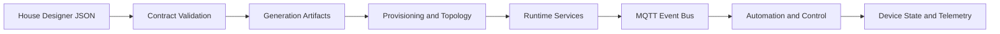

# SmartHouse Platform

**A local-first smart building operating framework for design-driven system generation.**

Mission: turn structured building intent into secure, deployable automation systems that run reliably at the edge.

SmartHouse is a local-first, event-driven smart building framework that turns design intent into deployable systems.

It combines:

- a modular microservice backbone
- secure MQTT messaging and protocol bridges
- a capability-based device model
- a house-designer JSON contract used as generation input

The core idea is simple: **design -> contract -> generation -> runtime**.

## What This Is

This repository is a professional prototype framework for building and evolving:

- device registries and automation runtimes
- edge and cloud service layers
- protocol integration paths (Modbus, KNX, BACnet)
- installer/provisioning workflows
- generation pipelines from structured building design

It is designed to scale from one house to multi-site deployments while keeping local operation as first priority.

## Architecture Snapshot

Platform layers:

1. Device Layer (real + simulated devices)
2. Protocol Translation Layer (bridges)
3. Messaging Layer (MQTT backbone)
4. Edge Controller Layer (local orchestration)
5. Cloud-Optional Layer (remote services)

Reference architecture and scope are defined in `docs/PROJECT_MASTER_SPEC.md`.

## System Flow

## Maturity Snapshot

| Area | Status | Notes |
| --- | --- | --- |
| Core backend services | Strong Prototype | Discovery dual-path, QoS policy, telemetry writer abstraction, metrics placeholders are in place. |
| Security baseline | Operational Baseline | mTLS, ACL, JWT/RBAC controls, and security verification scripts are integrated. |
| Design-to-contract pipeline | Strong Prototype | House designer JSON contract, schema validation, and parts generation pipeline are active. |
| Frontend experience | Prototype First | UX refinement and prototype review are prioritized before hardening. |
| Full production hardening | Planned | Tracked through inward execution and future hardening plan documents. |

## Runtime Services and Ports

Primary local endpoints:

- MQTT TLS: `localhost:8883`
- PostgreSQL: `localhost:5432`
- Device Registry API: `http://localhost:8081`
- Automation Engine API: `http://localhost:8082`
- Edge Controller API: `http://localhost:8084`
- Project Engine API: `http://localhost:8085`
- System Generator API: `http://localhost:8086`
- Cloud Services API: `http://localhost:8087`
- Installer Platform API: `http://localhost:8088`
- Telemetry API: `http://localhost:8089`
- AI Service API: `http://localhost:8090`
- Modbus Bridge API: `http://localhost:8091`
- KNX Bridge API: `http://localhost:8092`
- BACnet Bridge API: `http://localhost:8093`
- Observability API: `http://localhost:8094`

## Next Improvement Steps

The platform is designed for phased refinement. Current next steps:

1. Frontend prototype iteration before hardening.
Continue UX and workflow improvements from `docs/FRONTEND_PROTOTYPE_FIRST_FUTURE_PLAN.md` and start hardening only after prototype sign-off.

2. Generation output expansion.
Extend from parts-list output to topology, provisioning, and installer-ready artifacts while keeping JSON contract compatibility.

3. Inward hardening progression.
Execute the next hardening wave tracked in `docs/PROTOTYPE_INWARD_EXECUTION_PLAN.md` in small, verifiable increments.

## Where to Start

If your focus is solution design and generation:

1. Open `web/house_designer/index.html`.
2. Build hierarchy: `client -> properties -> subjects -> floors -> rooms -> units`.
3. Use `docs/HOUSE_DESIGNER_JSON_CONTRACT.md` for mapping rules.
4. Generate initial parts output with `scripts/generate_parts_list.py`.

If your focus is architecture and service development:

1. Read `docs/PROJECT_MASTER_SPEC.md`.
2. Read `docs/PROTOTYPE_INWARD_EXECUTION_PLAN.md`.
3. Follow `docs/FRONTEND_PROTOTYPE_FIRST_FUTURE_PLAN.md` for frontend direction.

## Documentation Guide

Use these as the primary map:

- `docs/DOCUMENTATION_INDEX.md`
What it contains: full doc/workflow/script index.

- `docs/PROJECT_MASTER_SPEC.md`
What it contains: platform mission, principles, and target architecture.

- `docs/PROTOTYPE_INWARD_EXECUTION_PLAN.md`
What it contains: implementation phases, current status, and hardening sequence.

- `docs/START_HERE_DESIGN_FLOW.md`
What it contains: design-to-artifact workflow for new contributors.

- `docs/HOUSE_DESIGNER_JSON_CONTRACT.md`
What it contains: canonical JSON contract and generation mapping rules.

- `docs/FRONTEND_PROTOTYPE_FIRST_FUTURE_PLAN.md`
What it contains: frontend to-do list, prototype-first policy, and Copilot next tasks.

## Internal Setup and Operations

Installation, environment replication, and operational commands are intentionally kept out of this GitHub-facing README.

Use:

- `docs/INTERNAL_SETUP_AND_OPERATIONS.md`
- `docs/WSL_REPRODUCIBLE_SETUP.md`
- `docs/VS_CODE_EXACT_SETUP.md`
- `docs/ONBOARDING_CHECKLIST.md`

## Validation Snapshot

Current scaffold verification target is maintained through repository verification scripts and CI workflows.

Start from:

- `scripts/run_full_verification.sh`
- `.github/workflows/stack-verification.yml`
